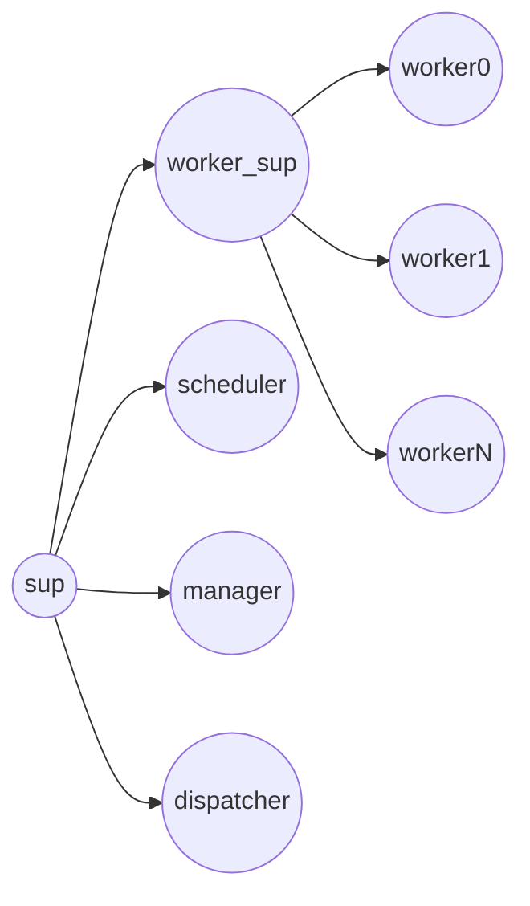

# Process structure:

```mermaid
flowchart LR

sup1((sup))
sup2((worker_sup))

gen_server1((scheduler))

gen_statem1((manager))
gen_statem2((dispatcher))
gen_statem3((worker0))
gen_statem4((worker1))
gen_statem5((workerN))

sup1 --> gen_statem1
sup1 --> gen_server1
sup1 --> gen_statem2
sup1 --> sup2

sup2 --> gen_statem3
sup2 --> gen_statem4
sup2 --> gen_statem5
```