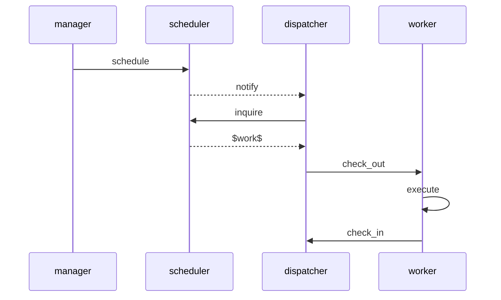

# Sequence diagram:

```mermaid
sequenceDiagram
    manager->>scheduler: schedule
    scheduler-->>dispatcher: notify
    dispatcher->>scheduler: inquire
    scheduler-->>dispatcher: $work$
    dispatcher->>worker: check_out
    worker->>worker: execute
    worker->>dispatcher: check_in
```